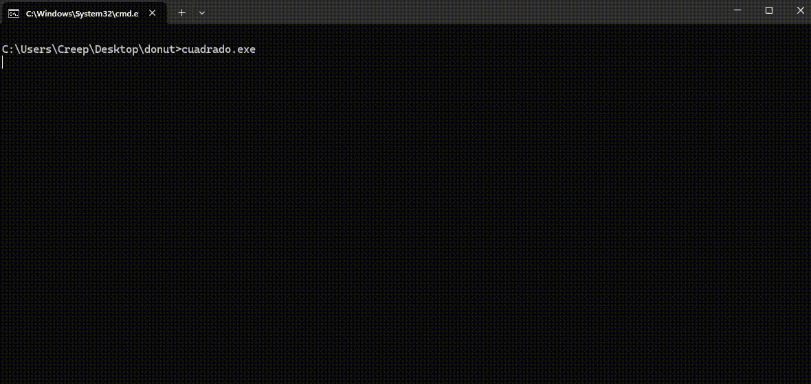

# ASCII Cube Engine

Un pequeño motor de renderizado 3D en **C++** que dibuja cubos y figuras en la terminal utilizando **ASCII art** con colores ANSI.  
El proyecto incluye un **Creeper de Minecraft** generado a partir de cubos con texturas personalizadas.

## Características

- Renderizado 3D en la terminal usando caracteres ASCII.
- Sombras y texturas simuladas mediante distintos caracteres (`.,-~:;=!*#$@`).
- Uso de **colores ANSI** para dar vida a los cubos.
- Motor extensible: se pueden añadir nuevos objetos cúbicos fácilmente.

## Requisitos

- Compilador C++ compatible con C++11 o superior.
- Una terminal que soporte **colores ANSI**.
- Sistema operativo: Linux, macOS o Windows (con terminal compatible, ej. Windows Terminal).

## Compilación

Clona este repositorio y compila con `g++`:

```bash
g++ ascii-cube-engine.cc -o ascii-cube-engine
```

## Ejemplos 
En la carpeta video_gif hay archivos MP4 y GIFs (peor calidad) con algunos ejemplos de lo que he conseguido hacer utilizando este motor, pero se podría construir casi cualquier cosa con bloques.





## Personalización
- Puedes modificar la **densidad**, que es la cantidad de puntos que se calculan por cara. Esto no hará que aumente siempre el relleno, sino que lo hará más preciso.

- El tamaño de pantalla está definido por screen_width y screen_height.

- Factor de escala modificable (K1) (más grande → más ancho).

- Factor distancia desde el “ojo” (K2) (más grande → más pequeño y alejado).

- Posición inicial de los objetos modificable, para centrarlos en pantalla (pos_extra_x, pos_extra_y).

- Colores ANSI configurables en cada cubo, para cada cara.

- Rotación controlada por las variables A, B y C (Velocidad y rotación inicial modificable).

### Para crear entornos personalizados
Dentro del main, se pueden modificar los valores iniciales de A, B y C para cambiar la rotación inicial de los objetos, junto al retraso_ms, que es el retraso en milisegundos de cada frame.
Además, dentro del while puedes modificar lo que se le suma a A, B y C para que gire más lento o rápido.

Dentro de la función render_frame, en el apartado de "Objetos a renderizar", puedes llamar a las funciones que crees convenientes para crear los objetos que quieras.

Las funciones disponibles son render_cubo y render_creeper:

render_cubo:
- ancho = anchura del cubo
- alto = altura del cubo
- profundo = profundidad del cubo
- x = posición x en el espacio 3D del cubo
- y = posición y en el espacio 3D del cubo
- z = posición z en el espacio 3D del cubo
- (sinA, cosA, sinB, cosB, sinC, cosC) = valores precalculados para optimizar el tiempo de ejecución
- output = estructura interna donde se guardarán los píxeles correspondientes
- zbuffer = estructura interna donde se guardará la profundidad de cada píxel del output
- ansi_codes = vector que asigna a cada cara el valor ANSI indicado con el orden: delante, derecha, detrás, izquierda, abajo, arriba

render_creeper:
- (sinA, cosA, sinB, cosB, sinC, cosC) = valores precalculados para optimizar el tiempo de ejecución
- output = estructura interna donde se guardarán los píxeles correspondientes
- zbuffer = estructura interna donde se guardará la profundidad de cada píxel del output
- x = posición x en el espacio 3D del cubo
- y = posición y en el espacio 3D del cubo
- z = posición z en el espacio 3D del cubo

## Extra
El archivo "creeper-ascii.cc" es un código con forma de creeper que ejecuta un creeper girando.


## Licencia

Este proyecto está bajo la Licencia MIT. Esto significa que puedes usar, copiar, modificar, fusionar, publicar, distribuir, siempre y cuando incluyas el aviso de copyright y esta licencia en todas las copias o partes sustanciales del software.
